# Design Document: React Wedding Site

## Overview

This design describes the rewrite of the existing static HTML/CSS/JS wedding invitation site for "Abhishek & Kanika" into a React single-page application built with Vite. The existing site features a rich Indian wedding theme with gold/cream/dark color palette, SVG decorative elements (diya lamps, temple silhouettes), scroll-driven reveal animations, floating particles, a live countdown timer, parallax scrolling effects, and responsive layouts.

The React rewrite preserves all visual design and interactive behavior while decomposing the monolithic HTML/JS into a component tree. Key third-party dependencies include `react-parallax` for parallax scrolling effects and `react` itself for component architecture. All animations (CSS keyframes, IntersectionObserver-based reveals, interval-based countdown) are reimplemented using React hooks and CSS modules or a global stylesheet.

### Key Design Decisions

1. **Vite + React**: Chosen per requirements. Vite provides fast HMR and optimized builds.
2. **react-parallax**: Used for parallax backgrounds on Hero, Blessings, Meet, and Countdown sections rather than a custom scroll handler.
3. **CSS approach**: A single global CSS file (`App.css`) preserving the existing styles, with minor adaptations for React class naming. No CSS-in-JS or CSS modules — the existing CSS is well-structured and complete.
4. **Custom hooks**: `useScrollReveal` wraps IntersectionObserver logic. `useCountdown` wraps the interval-based timer.
5. **Static data**: Event and info card data live in a `data/` constants file rather than being hardcoded in components.

## Architecture

The application follows a straightforward flat component architecture. The root `App` component renders all sections in order. Shared decorative elements (DiyaLamp, TempleDivider, SideOrnament, FloatingParticles) are reusable components. Animation behavior is encapsulated in custom hooks.

```mermaid
graph TD
    App --> FloatingParticles
    App --> HeroSection
    App --> TempleDivider1[TempleDivider]
    App --> BlessingsSection
    App --> TempleDivider2[TempleDivider dark]
    App --> EventsSection
    App --> TempleDivider3[TempleDivider]
    App --> MeetSection
    App --> RSVPSection
    App --> TempleDivider4[TempleDivider]
    App --> InfoSection
    App --> CountdownSection
    App --> Footer

    HeroSection --> DiyaLamp
    HeroSection --> TempleSilhouette[TempleBg SVG]
    BlessingsSection --> DiyaLamp
    BlessingsSection --> SideOrnament
    BlessingsSection --> ScrollReveal[useScrollReveal]
    EventsSection --> EventCard
    EventsSection --> DiyaLamp
    EventsSection --> ScrollReveal
    MeetSection --> DiyaLamp
    MeetSection --> SideOrnament
    MeetSection --> ScrollReveal
    InfoSection --> InfoCard
    InfoSection --> DiyaLamp
    InfoSection --> ScrollReveal
    CountdownSection --> useCountdown
    CountdownSection --> SparkleSystem
    CountdownSection --> TempleSilhouette
```



### File Structure

```
src/
├── App.jsx              # Root component, renders all sections
├── App.css              # Global styles (adapted from existing style.css)
├── main.jsx             # Vite entry point
├── data/
│   └── constants.js     # Event list, info cards, particle symbols
├── components/
│   ├── HeroSection.jsx
│   ├── BlessingsSection.jsx
│   ├── EventsSection.jsx
│   ├── EventCard.jsx
│   ├── MeetSection.jsx
│   ├── RSVPSection.jsx
│   ├── InfoSection.jsx
│   ├── InfoCard.jsx
│   ├── CountdownSection.jsx
│   ├── Footer.jsx
│   ├── DiyaLamp.jsx
│   ├── TempleDivider.jsx
│   ├── TempleBg.jsx
│   ├── SideOrnament.jsx
│   ├── FloatingParticles.jsx
│   └── SparkleSystem.jsx
├── hooks/
│   ├── useScrollReveal.js
│   └── useCountdown.js
index.html               # Vite HTML entry with Google Fonts link
```

## Components and Interfaces

### App (Root)

Renders all sections and decorative dividers in order. No props. Manages no state.

```jsx
function App() {
  return (
    <>
      <FloatingParticles />
      <HeroSection />
      <TempleDivider variant="light" />
      <BlessingsSection />
      <TempleDivider variant="dark" />
      <EventsSection />
      <TempleDivider variant="light" />
      <MeetSection />
      <RSVPSection />
      <TempleDivider variant="light" />
      <InfoSection />
      <CountdownSection />
      <Footer />
    </>
  );
}
```

### HeroSection

Full-viewport landing with animated couple names, ornament line, floating symbols, diya lamps, and temple silhouette. All animations are CSS-driven (keyframes on mount). Uses `react-parallax`'s `<Parallax>` component to wrap the background.

**Props**: None

### BlessingsSection

Displays Sanskrit invocation, parent names, couple names, invitation text. Each text element uses `useScrollReveal` with staggered delays. Contains `DiyaLamp` (left/right) and `SideOrnament` with parallax via `react-parallax`.

**Props**: None

### EventsSection

Renders "Celebrations" heading and a grid of `EventCard` components. Data sourced from `constants.js`. Uses `useScrollReveal` with stagger on the grid container.

**Props**: None

### EventCard

Displays a single event's details with hover effects.

```typescript
interface EventCardProps {
  name: string;       // e.g. "Mehendi"
  date: string;       // e.g. "Friday, March 9th 2026"
  venue: string;      // e.g. "Rambagh, Jaipur"
  time: string;       // e.g. "6pm Onwards"
  mapUrl: string;     // Google Maps URL
}
```

### MeetSection

Personal message from the couple. Contains `DiyaLamp`, `SideOrnament` with parallax, and scroll reveal.

**Props**: None

### RSVPSection

WhatsApp CTA button with pulse animation and hover fill effect.

**Props**: None

### InfoSection

Renders "Things to Know" heading, subtitle, and a grid of `InfoCard` components. Data from `constants.js`.

**Props**: None

### InfoCard

Displays a single info item with bobbing icon animation.

```typescript
interface InfoCardProps {
  icon: string;        // emoji/symbol character
  title: string;       // e.g. "Hashtag"
  description: string; // HTML string or plain text
  index: number;       // for staggered animation delay
}
```

### CountdownSection

Live countdown to wedding date. Uses `useCountdown` hook. Contains `SparkleSystem` and `TempleBg`.

**Props**: None

### Footer

Static copyright text.

**Props**: None

### DiyaLamp

Reusable SVG oil lamp with animated flame glow.

```typescript
interface DiyaLampProps {
  position: 'left' | 'right';  // determines CSS class for positioning
  className?: string;           // additional CSS classes (e.g. 'diya-decor' vs 'section-diya')
}
```

### TempleDivider

Full-width SVG divider between sections.

```typescript
interface TempleDividerProps {
  variant: 'light' | 'dark';  // background color variant
}
```

### TempleBg

Temple silhouette SVG used in Hero and Countdown sections.

**Props**: None (styled via parent CSS)

### SideOrnament

Decorative symbol with parallax movement via `react-parallax`.

```typescript
interface SideOrnamentProps {
  symbol: string;              // e.g. "❋" or "✧"
  position: 'left' | 'right';
}
```

### FloatingParticles

Fixed overlay of 15 drifting symbol particles. Generates particles on mount with randomized positions, sizes, and animation durations.

**Props**: None

### SparkleSystem

20 animated dots rising within the Countdown section. Similar generation pattern to FloatingParticles but scoped to parent container.

**Props**: None

### useScrollReveal (Custom Hook)

Wraps IntersectionObserver to add `revealed` class and stagger children.

```typescript
function useScrollReveal(ref: RefObject<HTMLElement>, options?: {
  threshold?: number;    // default 0.1
  rootMargin?: string;   // default "0px 0px -50px 0px"
  stagger?: boolean;     // if true, staggers children with 120ms delay
}): void
```

### useCountdown (Custom Hook)

Returns live countdown values, updating every second.

```typescript
function useCountdown(targetDate: Date): {
  days: string;    // zero-padded, e.g. "05"
  hours: string;
  minutes: string;
  seconds: string;
  isComplete: boolean;
}
```

## Data Models

### Event Data

```typescript
interface WeddingEvent {
  name: string;
  date: string;
  venue: string;
  time: string;
  mapUrl: string;
}
```

Static array of 6 events (Mehendi, Haldi, Cocktail, Engagement, Shaadi, Reception). All share the same venue URL (`https://maps.google.com/?q=Rambagh+Palace+Jaipur`).

### Info Card Data

```typescript
interface InfoItem {
  icon: string;
  title: string;
  description: string;
}
```

Static array of 4 items (Hashtag, Weather, Stay, Parking).

### Countdown Target

```typescript
const WEDDING_DATE = new Date("2026-03-12T18:00:00+05:30");
```

### Particle Configuration

```typescript
const PARTICLE_SYMBOLS = ["✦", "✧", "❋", "❊", "·", "⋆"];
const PARTICLE_COUNT = 15;
const SPARKLE_COUNT = 20;
```

### Color Theme (CSS Custom Properties)

```css
:root {
  --gold: #c9a96e;
  --dark: #1a1a1a;
  --cream: #faf7f2;
  --text: #333;
  --light-gold: #e8d5a8;
}
```


## Correctness Properties

*A property is a characteristic or behavior that should hold true across all valid executions of a system — essentially, a formal statement about what the system should do. Properties serve as the bridge between human-readable specifications and machine-verifiable correctness guarantees.*

### Property 1: EventCard renders all required content

*For any* valid `WeddingEvent` object with a name, date, venue, time, and mapUrl, rendering an `EventCard` with that data should produce output containing the event name, date, venue, time, and a link element with `href` equal to the mapUrl and `target="_blank"`.

**Validates: Requirements 4.4, 4.5**

### Property 2: InfoCard renders all required content

*For any* valid `InfoItem` object with an icon, title, and description, rendering an `InfoCard` with that data should produce output containing the icon character, the title text, and the description text.

**Validates: Requirements 7.3**

### Property 3: Countdown computation correctness

*For any* date/time before March 12, 2026 at 18:00 IST, the `useCountdown` hook should return days, hours, minutes, and seconds values that, when converted back to a total millisecond difference, equal the actual difference between the input time and the wedding date (within 1 second tolerance).

**Validates: Requirements 8.2**

### Property 4: Countdown zero-padding format

*For any* non-negative integer value for days, hours, minutes, or seconds (where hours < 24, minutes < 60, seconds < 60), the formatted countdown string for that unit should be exactly 2 characters long and consist only of digits.

**Validates: Requirements 8.4**

### Property 5: TempleDivider variant rendering

*For any* variant value in `['light', 'dark']`, rendering a `TempleDivider` with that variant should produce an element with the corresponding background class (`temple-divider` for light, `temple-divider dark` for dark) and contain an SVG element.

**Validates: Requirements 9.4**

### Property 6: ScrollReveal direction mapping

*For any* reveal direction in `['up', 'left', 'right', 'scale']`, an element with that `data-reveal` attribute should have the correct initial CSS transform applied: "up" → `translateY(40px)`, "left" → `translateX(-60px)`, "right" → `translateX(60px)`, "scale" → `scale(0.85)`.

**Validates: Requirements 10.3**

### Property 7: ScrollReveal stagger delay calculation

*For any* container with N child elements (where N > 0), when the container is revealed with stagger enabled, the i-th child (0-indexed) should receive a `transitionDelay` of `i * 120` milliseconds.

**Validates: Requirements 10.4**

### Property 8: Particle generation bounds

*For any* generated floating particle, its font size should be between 8px and 18px (inclusive), its horizontal position (`left`) should be between 0% and 100%, and its animation duration should be between 12s and 30s.

**Validates: Requirements 12.2, 12.3**

## Error Handling

This is a static wedding invitation site with no backend, user input forms, or API calls. Error handling is minimal:

- **Countdown past target date**: When `new Date()` exceeds the wedding date, `useCountdown` returns `{ days: "00", hours: "00", minutes: "00", seconds: "00", isComplete: true }` and clears the interval to stop updates. No negative values are ever displayed.
- **IntersectionObserver unavailability**: If `IntersectionObserver` is not supported (very old browsers), `useScrollReveal` should degrade gracefully by immediately showing all elements (set `revealed` class on mount).
- **react-parallax fallback**: If parallax rendering fails, the content still renders normally since parallax is purely decorative. The `<Parallax>` component from `react-parallax` renders children regardless.
- **Missing Google Fonts**: If fonts fail to load, the CSS font stacks fall back to generic `serif` and `sans-serif` families, maintaining readability.
- **WhatsApp link**: The `wa.me` link opens in a new tab. If WhatsApp is not installed, the browser handles the URL natively (WhatsApp Web or app store redirect). No custom error handling needed.

## Testing Strategy

### Unit Tests

Unit tests verify specific examples, edge cases, and component rendering:

- **Component rendering**: Each section component renders without crashing and contains expected static text content (e.g., "ABHISHEK", "ॐ श्री गणेशाय नमः", "Celebrations", "© 2026 Abhishek & Kanika")
- **Event data**: Exactly 6 event cards render with correct names (Mehendi, Haldi, Cocktail, Engagement, Shaadi, Reception)
- **Info data**: Exactly 4 info cards render with correct titles (Hashtag, Weather, Stay, Parking)
- **Countdown edge case**: When current date is past the wedding date, countdown displays "00" for all units and `isComplete` is true
- **Floating particles**: Exactly 15 particle elements render; exactly 20 sparkle elements render
- **Footer text**: Footer contains "© 2026 Abhishek & Kanika"
- **WhatsApp link**: RSVP link has `href` starting with `https://wa.me/` and `target="_blank"`
- **DiyaLamp SVG structure**: SVG contains expected elements (ellipse, path, rect, circle with animate)
- **TempleDivider SVG**: SVG element renders for both light and dark variants
- **ScrollReveal unobserve**: After an element is revealed, `unobserve` is called on it

Use **Vitest** with **React Testing Library** (`@testing-library/react`) for component tests.

### Property-Based Tests

Property-based tests verify universal properties across randomly generated inputs. Use **fast-check** as the property-based testing library.

Each property test must:
- Run a minimum of 100 iterations
- Reference its design document property with a tag comment

**Property test implementations:**

1. **Feature: react-wedding-site, Property 1: EventCard renders all required content** — Generate random event objects, render EventCard, assert all fields appear in output
2. **Feature: react-wedding-site, Property 2: InfoCard renders all required content** — Generate random info items, render InfoCard, assert icon/title/description appear
3. **Feature: react-wedding-site, Property 3: Countdown computation correctness** — Generate random dates before the wedding, compute countdown, verify round-trip arithmetic
4. **Feature: react-wedding-site, Property 4: Countdown zero-padding format** — Generate random time unit values (0–99 for days, 0–23 for hours, 0–59 for min/sec), verify 2-digit zero-padded string output
5. **Feature: react-wedding-site, Property 5: TempleDivider variant rendering** — For each variant, verify correct CSS class and SVG presence
6. **Feature: react-wedding-site, Property 6: ScrollReveal direction mapping** — For each direction, verify correct initial transform value in CSS
7. **Feature: react-wedding-site, Property 7: ScrollReveal stagger delay calculation** — Generate random child counts (1–20), verify each child's delay equals index × 120ms
8. **Feature: react-wedding-site, Property 8: Particle generation bounds** — Generate particles, verify font size ∈ [8, 18], left ∈ [0, 100], duration ∈ [12, 30]

Each correctness property is implemented by a single property-based test. Property tests complement unit tests: unit tests catch specific rendering bugs, property tests verify general correctness across all valid inputs.
